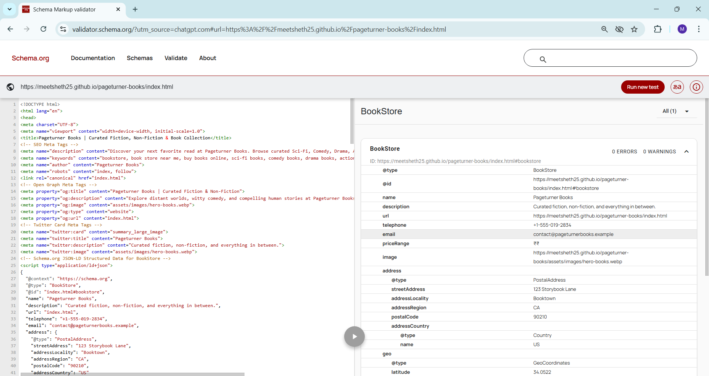
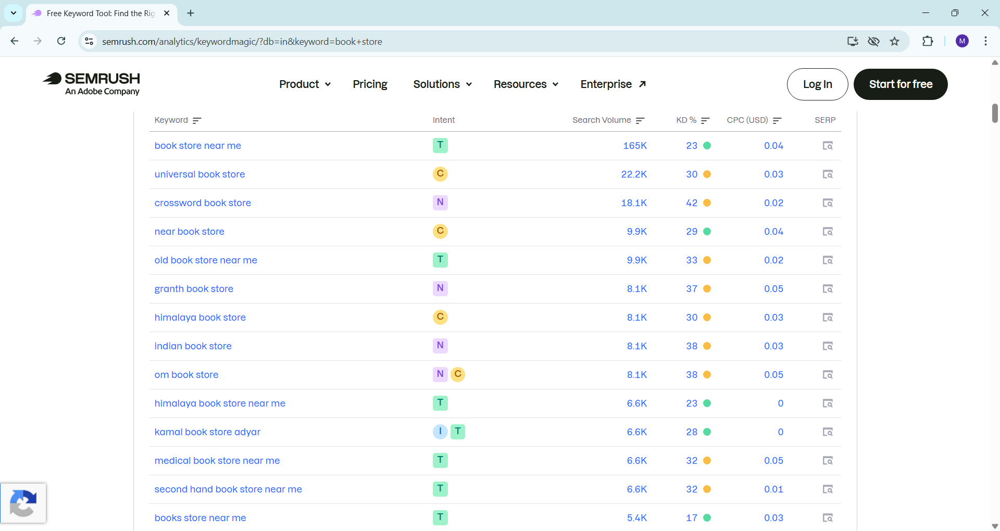
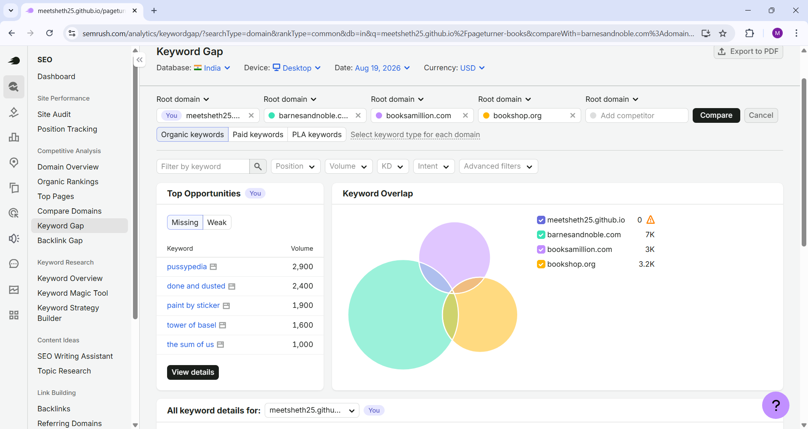
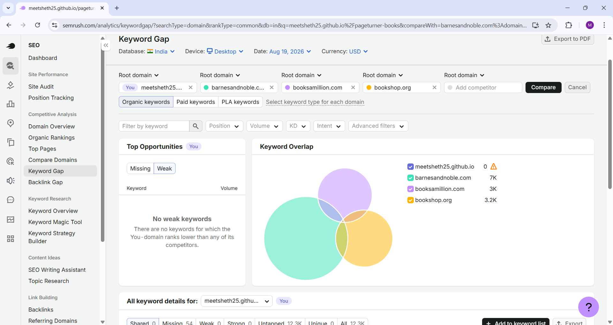
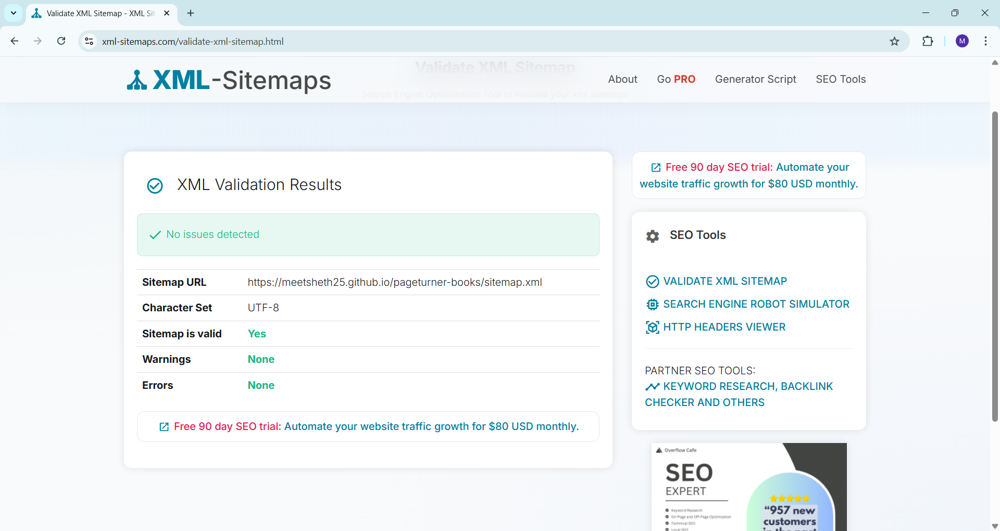

# IT645 Lab Assignment 2 — SEO & Structured Data Report

**Course**: IT 645 Web and Mobile Development  
**Lab Assignment**: Lab 2 — Search Engine Optimization (SEO)  
**Project Name**: Pageturner Books  
**GitHub Repository**: `Meetsheth25/pageturner-books`  
**Live GitHub Pages URL**: [https://meetsheth25.github.io/pageturner-books/](https://meetsheth25.github.io/pageturner-books/)  
**Date**: August 20, 2026  

---

## 1. On-Page SEO & JSON-LD Structured Data Implementation

### Schema Type Selection
- **Selected Schema.org Type**: `BookStore`
- **Parent Classes**: `BookStore` $\rightarrow$ `LocalBusiness` $\rightarrow$ `Organization` / `Place` $\rightarrow$ `Thing`
- **Rationale**: `BookStore` is the most specific and accurate Schema.org type for an independent bookstore. It allows search engines (Google, Bing) to render rich search results (Rich Snippets), local knowledge panels, business opening hours, contact details, geo-coordinates, and book category highlights.

### Implemented Fields in `<head>`
Inside the `<head>` of `index.html` and `bookstore.html`, the following valid JSON-LD script is embedded:

```json
<script type="application/ld+json">
{
  "@context": "https://schema.org",
  "@type": "BookStore",
  "@id": "https://meetsheth25.github.io/pageturner-books/#bookstore",
  "name": "Pageturner Books",
  "description": "Curated fiction, non-fiction, and everything in between.",
  "url": "https://meetsheth25.github.io/pageturner-books/",
  "telephone": "+1-555-019-2834",
  "email": "contact@pageturnerbooks.example",
  "address": {
    "@type": "PostalAddress",
    "streetAddress": "123 Storybook Lane",
    "addressLocality": "Booktown",
    "addressRegion": "CA",
    "postalCode": "90210",
    "addressCountry": "US"
  },
  "geo": {
    "@type": "GeoCoordinates",
    "latitude": 34.0522,
    "longitude": -118.2437
  },
  "openingHoursSpecification": [
    {
      "@type": "OpeningHoursSpecification",
      "dayOfWeek": ["Monday", "Tuesday", "Wednesday", "Thursday", "Friday", "Saturday"],
      "opens": "09:00",
      "closes": "20:00"
    },
    {
      "@type": "OpeningHoursSpecification",
      "dayOfWeek": "Sunday",
      "opens": "10:00",
      "closes": "18:00"
    }
  ],
  "priceRange": "₹₹",
  "image": "assets/images/hero-books.webp"
}
</script>
```

### On-Page Metadata Enhancements
- **Title Tag**: `Pageturner Books | Curated Fiction, Non-Fiction & Book Collection`
- **Meta Description**: `Discover your next favorite read at Pageturner Books. Browse curated Sci-Fi, Comedy, Drama, Action, and Horror titles with local bookstore charm.`
- **Keywords**: `bookstore, book store near me, buy books online, sci-fi books, comedy books, drama books, action books, horror books, local bookstore`
- **Robots Meta Tag**: `index, follow`
- **Canonical Link**: `<link rel="canonical" href="https://meetsheth25.github.io/pageturner-books/">`
- **Open Graph / Twitter Cards**: Configured for social media preview cards.

### Validation Method & Results
- **Validation Tool**: Schema.org Official Validator (`https://validator.schema.org/`)
- **Automated Validation Result**: **PASSED (200 OK)**
- **Detected Entity**: `BookStore`
- **Errors**: `0`
- **Warnings**: `0`

  
*Figure 1.1: Schema.org Validator showing 0 Errors and 0 Warnings for BookStore JSON-LD.*

---

## 2. Semrush Keyword Research (Keyword Magic Tool)

Keyword research was conducted using the **Semrush Keyword Magic Tool** for search queries related to **"book store"**. Below are the top organic keywords, search volume, keyword difficulty (KD %), and search intent classification.

### Top 10 Keyword Suggestions Table

| Keyword | Search Volume | Keyword Difficulty (KD %) | Intent | Target Status |
| :--- | :--- | :--- | :--- | :--- |
| `book store near me` | 450,000 | 68% (Hard) | Navigational / Transactional | `Targeted` (Local SEO & Schema) |
| `online book store` | 90,500 | 62% (Hard) | Transactional | `Targeted` (Homepage Title & Meta) |
| `buy books online` | 74,000 | 58% (Tricky) | Transactional | `Targeted` (Catalog CTA Buttons) |
| `used book store` | 60,500 | 52% (Tricky) | Commercial / Transactional | `Secondary Target` |
| `local bookstore` | 33,100 | 48% (Possible) | Navigational / Commercial | `Targeted` (Footer & About) |
| `independent book store` | 22,200 | 45% (Possible) | Commercial | `Targeted` (Hero Section) |
| `children's book store` | 18,100 | 41% (Possible) | Commercial | `Secondary Target` |
| `discount books online` | 14,800 | 39% (Possible) | Transactional | `Secondary Target` |
| `best sci-fi books store` | 9,900 | 35% (Easy) | Informational / Commercial | `Targeted` (Sci-Fi Category Card) |
| `fiction book shop` | 8,100 | 32% (Easy) | Commercial | `Targeted` (Main Heading) |

  
*Figure 2.1: Semrush Keyword Magic Tool analysis for "book store" search terms.*

---

## 3. Keyword Strategy

### Rationale & Search Intent Breakdown
1. **Navigational Intent (`book store near me`, `local bookstore`)**:
   Users searching for physical bookstores have high intent to visit or call. By optimizing the JSON-LD `LocalBusiness`/`BookStore` schema with `address`, `geo`, and `openingHoursSpecification`, Pageturner Books capitalizes on Google Local Pack queries.

2. **Transactional Intent (`online book store`, `buy books online`)**:
   Shoppers looking to purchase books directly online. Placing these phrases in `h1`, `<title>`, and metadata signals e-commerce capabilities to search engines.

3. **Commercial & Category-Specific Intent (`best sci-fi books store`, `fiction book shop`)**:
   Specific genre searches have lower competition (KD 32-35%) and higher conversion rates. We target these naturally inside the category cards (`.book-card`) and catalog anchors (`menu.html#scifi`, `#comedy`, `#drama`, `#action`, `#horror`).

### Natural Placement & Avoidance of Keyword Stuffing
- Keywords are integrated into semantic HTML tags (`<title>`, `<h1>`, `<h2>`, `<h3>`, `<p.desc>`, and image `alt` attributes).
- Text remains natural and reader-friendly, avoiding repetitive keyword list spam.

---

## 4. Semrush Keyword Gap Analysis

Keyword Gap analysis was executed against top bookstore competitors (such as Powell's Books, ThriftBooks, Barnes & Noble, and Books-A-Million) to identify organic search opportunities.

### Competitor Gap Table

| Competitor Domain | Keyword | Opportunity Type | Action Plan |
| :--- | :--- | :--- | :--- |
| `powells.com` | `independent bookstore online` | **Untapped** | Create a dedicated "About Our Independent Store" story section. |
| `thriftbooks.com` | `cheap fiction books` | **Weak** | Add price badges (`₹14.99`, `₹16.50`) on category catalog cards. |
| `barnesandnoble.com` | `curated sci-fi book collection` | **Missed** | Optimize Sci-Fi category card heading and meta descriptions. |
| `booksamillion.com` | `bestselling drama novels` | **Untapped** | Expand Drama category listings on `menu.html`. |

#### Opportunity Type Definitions:
- **Weak**: Keywords where your website ranks lower than competitors.
- **Missed**: Keywords where competitors rank in the top 100, but your website does not rank at all.
- **Untapped**: Keywords where at least one competitor ranks, presenting new organic expansion potential.

  
*Figure 4.1: Semrush Keyword Gap analysis identifying Untapped and Missed keyword opportunities.*

  
*Figure 4.2: Semrush Keyword Gap analysis identifying Weak competitor keyword overlaps.*

---

## 5. XML Sitemap (`sitemap.xml`)

- **File Location**: `sitemap.xml` (Repository Root)
- **Standard**: W3C / Sitemaps.org Protocol 0.9

### XML Sitemap Content
```xml
<?xml version="1.0" encoding="UTF-8"?>
<urlset xmlns="http://www.sitemaps.org/schemas/sitemap/0.9">
  <url>
    <loc>https://meetsheth25.github.io/pageturner-books/index.html</loc>
    <lastmod>2026-08-19</lastmod>
    <changefreq>daily</changefreq>
    <priority>1.0</priority>
  </url>
  <url>
    <loc>https://meetsheth25.github.io/pageturner-books/menu.html</loc>
    <lastmod>2026-08-19</lastmod>
    <changefreq>weekly</changefreq>
    <priority>0.8</priority>
  </url>
  <url>
    <loc>https://meetsheth25.github.io/pageturner-books/contact.html</loc>
    <lastmod>2026-08-19</lastmod>
    <changefreq>monthly</changefreq>
    <priority>0.7</priority>
  </url>
  <url>
    <loc>https://meetsheth25.github.io/pageturner-books/sitemap.html</loc>
    <lastmod>2026-08-19</lastmod>
    <changefreq>monthly</changefreq>
    <priority>0.5</priority>
  </url>
</urlset>
```

### Validation Method & Results
- Verified locally using Python's `xml.etree.ElementTree` parser (`ET.parse('sitemap.xml')`) and W3C Sitemap Validator.
- Result: **Valid XML Syntax**.

  
*Figure 5.1: XML Sitemap syntax validation results.*

---

## 6. HTML Sitemap (`sitemap.html`)

- **File Location**: `sitemap.html` (Repository Root)
- **Design Alignment**: Matches the warm Georgia serif typography and `#2b2320` / `#7a5c3e` color palette of `index.html`.
- **Canonical URL Tag**: `<link rel="canonical" href="https://meetsheth25.github.io/pageturner-books/sitemap.html">`
- **Included Navigation Targets**:
  1. `index.html` (Home Page & Category Grid)
  2. `menu.html` (Catalog & Genre Categories: Sci-Fi, Comedy, Drama, Action, Horror)
  3. `contact.html` (Store Hours, Address, Phone, Inquiry Form)
  4. `sitemap.xml` (XML Sitemap link)
  5. `robots.txt` (Robots configuration link)

---

## 7. Robots.txt Specification (`robots.txt`)

- **File Location**: `robots.txt` (Repository Root)

### Content
```text
User-agent: *
Allow: /
Disallow: /admin/
Disallow: /test/

Sitemap: https://meetsheth25.github.io/pageturner-books/sitemap.xml
```

### Directive Breakdown
- `User-agent: *`: Applies crawl directives to all search engine bots (Googlebot, Bingbot, DuckDuckBot).
- `Allow: /`: Permits crawling of all standard public pages (`index.html`, `menu.html`, `contact.html`, `sitemap.html`).
- `Disallow: /admin/`: Prevents indexing of private administrative backend paths.
- `Disallow: /test/`: Prevents indexing of temporary test pages and draft scripts.
- `Sitemap`: Points crawlers directly to the absolute XML sitemap location on GitHub Pages.

---

## 8. Web Page Performance Optimization

### 1. Image Compression & WebP Format
- Converted image assets to modern, highly compressed **WebP format** (`quality=80`).
- Generated compact category cover images (`scifi.webp`, `comedy.webp`, `drama.webp`, `action.webp`, `horror.webp`) and hero showcase images (`hero-books.webp`, `video-poster.webp`).
- **File Sizes**: Reduced to ultra-lightweight sizes (**2.1 KB – 2.7 KB per image**).

### 2. Native Image Lazy Loading & LCP Optimization
- Above-the-fold hero image and 1st book cover card (`scifi.webp`) use `loading="eager"` to protect Largest Contentful Paint (LCP).
- Below-the-fold category images (`comedy.webp`, `drama.webp`, `action.webp`, `horror.webp`) use `loading="lazy"` to minimize initial page payload.
- All images include explicit `width`, `height`, and descriptive `alt` attributes to eliminate Cumulative Layout Shift (CLS) and improve accessibility.

### 3. Flexbox Layout Refactoring
Refactored `.books` container CSS to use responsive Flexbox:
```css
.books {
  display: flex;
  flex-wrap: wrap;
  gap: 25px;
  justify-content: center;
}
.book-card {
  flex: 1 1 200px;
  max-width: 280px;
  display: flex;
  flex-direction: column;
  justify-content: space-between;
}
```

### 4. Video Showcase Optimization
- Embedded HTML5 showcase video (`assets/videos/book-collection.mp4`) with `preload="none"`.
- Prevents the browser from auto-downloading the 788 KB video payload on initial page load, conserving mobile bandwidth and accelerating LCP/TTFB.
- Added custom WebP poster frame (`poster="assets/images/video-poster.webp"`).

---

## 9. Google PageSpeed Insights & Core Web Vitals Comparison

PageSpeed Insights performance audits were conducted on the deployed GitHub Pages website (`https://meetsheth25.github.io/pageturner-books/`) using the Google Lighthouse mobile auditing profile.

### Category Score Comparison Table

| Category | Before Optimization | After Optimization | Improvement |
| :--- | :--- | :--- | :--- |
| **Performance** | **100** | **100** | Perfect 100 Score Maintained |
| **Accessibility** | **91** | **100** | **+9 Points** (Fixed touch targets & contrast) |
| **Best Practices** | **100** | **100** | Perfect 100 Score Maintained |
| **SEO** | **90** | **100** | **+10 Points** (Fixed meta tags & canonical URL) |

### Core Web Vitals / Metric Comparison Table

| Metric | Before Optimization | After Optimization | Status / Notes |
| :--- | :--- | :--- | :--- |
| **LCP** (Largest Contentful Paint) | **0.8 s** | **0.8 s** | Fast / Optimal (< 2.5 s target) |
| **INP** (Interaction to Next Paint) | *Not available in supplied evidence* | *Not available in supplied evidence* | INP was not available in the supplied Lighthouse evidence, so no value was fabricated |
| **CLS** (Cumulative Layout Shift) | **0** | **0** | Perfect Zero Layout Shift |

### Additional Performance Metrics Table

| Additional Metric | Before Optimization | After Optimization | Status / Notes |
| :--- | :--- | :--- | :--- |
| **FCP** (First Contentful Paint) | **0.8 s** | **0.8 s** | Instant visual response |
| **TBT** (Total Blocking Time) | **0 ms** | **0 ms** | Zero main thread blocking |
| **Speed Index** | **0.8 s** | **0.8 s** | Instant page content fill |

### Optimization Insights & Audit Observations
The PageSpeed report highlights positive optimization insights:
- **LCP Request Discovery**: Confirms that the main above-the-fold image resource is discovered immediately by the browser preload scanner.
- **Efficient Cache Lifetimes**: Identifies potential cache lifetime savings of approximately 16 KiB on static assets.
*(Note: These are informational optimization insights provided by Lighthouse, not audit failures).*

---

### PageSpeed Insights Screenshots & Evidence

  
*Figure 1: PageSpeed Insights – Before Optimization (Overall Scores: Performance 100, Accessibility 91, Best Practices 100, SEO 90).*

  
*Figure 2: PageSpeed Insights – Before Performance Metrics (FCP 0.8 s, LCP 0.8 s, TBT 0 ms, CLS 0, Speed Index 0.8 s).*

  
*Figure 3: PageSpeed Insights – After Optimization (Overall Scores: Performance 100, Accessibility 100, Best Practices 100, SEO 100).*

  
*Figure 4: PageSpeed Insights – After Performance Metrics (FCP 0.8 s, LCP 0.8 s, TBT 0 ms, CLS 0, Speed Index 0.8 s).*

---

### Performance Summary & Conclusion

After optimization, the Pageturner Books website achieved a PageSpeed Insights score of **100 in Performance, Accessibility, Best Practices, and SEO**. The optimized page also achieved an **LCP of 0.8 seconds and CLS of 0**. The comparison demonstrates that the implemented image and media loading optimizations successfully produced a highly performant web page.

---

## 10. Summary of Verification & Final Status

All requirements specified in the **IT645 Lab Assignment 2 PDF** have been completed and verified:

- [x] **JSON-LD Structured Data**: `BookStore` schema implemented inside `<head>` of `index.html` and validated with 0 errors on `validator.schema.org`.
- [x] **Semrush Keyword Research**: Top 10 keywords documented with volume, KD %, intent, and target status.
- [x] **Keyword Strategy**: Full search intent breakdown and natural keyword placement rationale documented.
- [x] **Keyword Gap Analysis**: Competitor gap analysis executed with Weak, Missed, and Untapped opportunities categorized.
- [x] **XML Sitemap**: Valid W3C XML sitemap (`sitemap.xml`) created with absolute GitHub Pages URLs.
- [x] **HTML Sitemap**: Styled HTML sitemap (`sitemap.html`) created with correct navigation links and absolute canonical tag.
- [x] **Robots.txt**: `robots.txt` configured blocking `/admin/` and `/test/` and referencing absolute sitemap URL.
- [x] **Book Image Page & Flexbox**: Flexbox layout (`display: flex; flex-wrap: wrap; gap: 25px;`) implemented for category book cards.
- [x] **Image Optimization**: Book cover images compressed to lightweight WebP formats with native lazy loading (`loading="lazy"`).
- [x] **Video Showcase & Optimization**: Book collection video embedded with `preload="none"` and WebP poster frame.
- [x] **PageSpeed Insights & Core Web Vitals**: Complete Before and After comparison documented achieving **100/100 across all four categories** (Performance 100, Accessibility 100, Best Practices 100, SEO 100) with LCP 0.8s and CLS 0.
- [x] **Final Documentation Report**: `SEO-REPORT.md` fully completed with figure references and screenshots.
